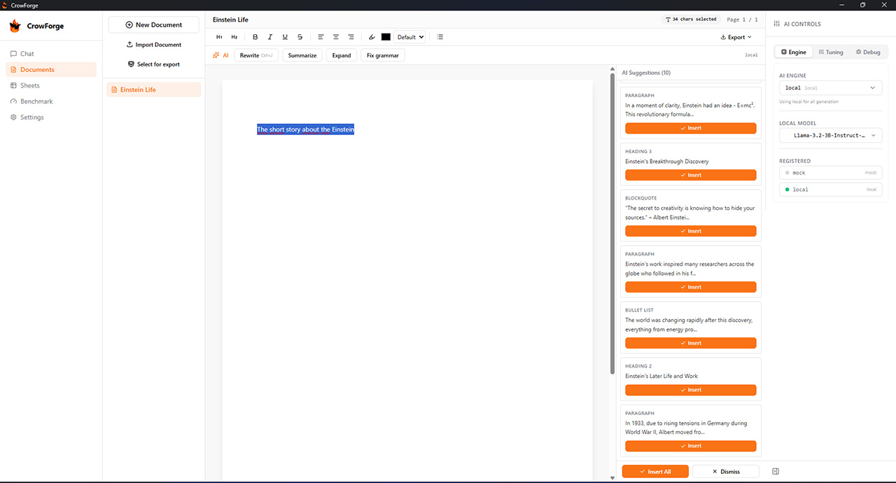
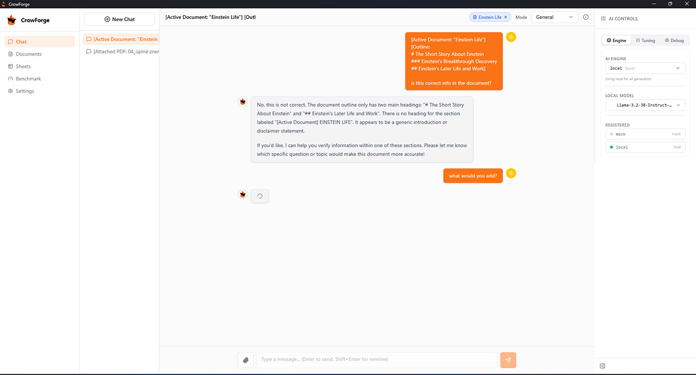
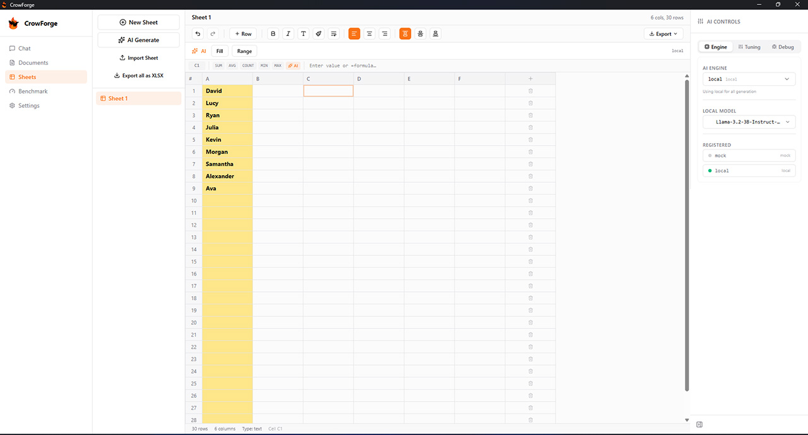
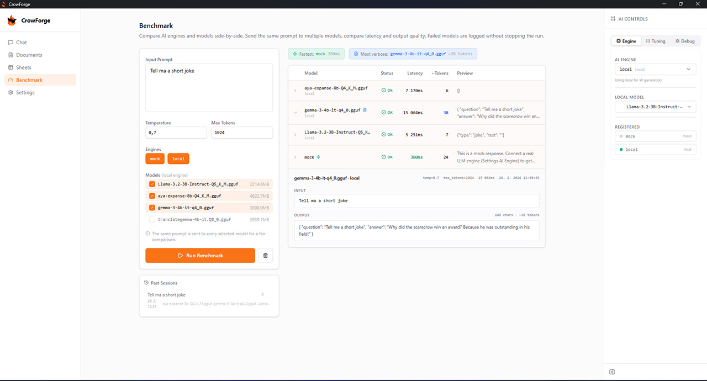
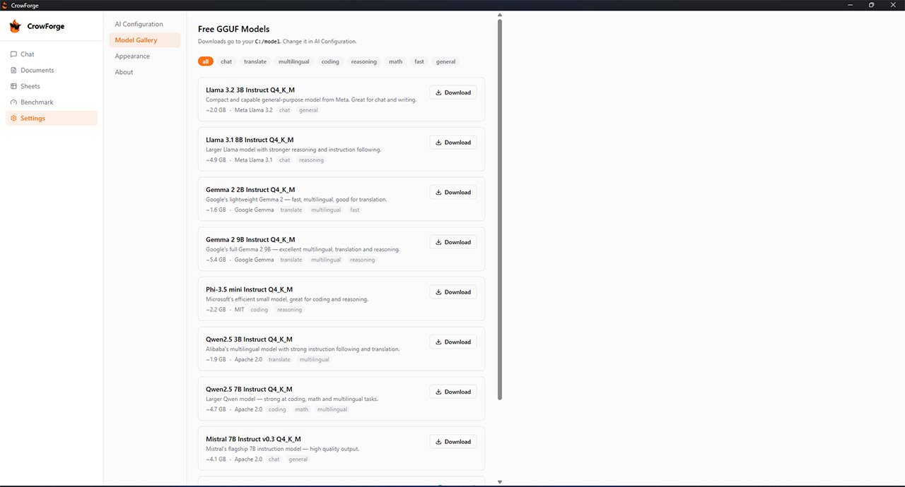

# CrowForge

A **local-first AI workspace** — Chat, Documents, Sheets, and Benchmarking — running entirely on your machine. No cloud, no telemetry, no subscriptions.

Bring your own model: connect a local GGUF file, any OpenAI-compatible API (OpenAI, Ollama, LM Studio, etc.), or download a free model directly from the built-in gallery.

Built with **Tauri v2** · **React 19 / TypeScript** · **Python FastAPI** · **SQLite**

> **🚧 Early Access** — CrowForge is actively being developed. Things may break, features are still being added, and the project is evolving fast. Feedback, issues, and contributions are very welcome!

## Download

| Platform | Installer |
|----------|-----------|
| Windows x64 | [CrowForge_0.1.0_x64-setup.exe](http://sanchez.sk/tools/CrowForge_0.1.0_x64-setup.exe) |

---

## Screenshots

<table>
  <tr>
    <td></td>
    <td></td>
  </tr>
  <tr>
    <td></td>
    <td></td>
  </tr>
  <tr>
    <td></td>
    <td></td>
  </tr>
</table>

---

## Features

### Chat
- Multi-session conversation history with persistent storage
- Context modes: General, Writing, Coding, Analysis, Brainstorm
- Connect a document as active context — the AI can answer questions about it
- Attach files (PDF, TXT, DOCX) to any message
- Markdown rendering for AI responses with one-click code copy
- Customisable user avatar (emoji animals)

### Documents
- Rich text editor (TipTap) with heading styles, bold, italic, underline, strikethrough, lists, blockquotes, code blocks
- Text alignment, highlight, text colour, and font family controls
- Document outline panel (auto-generated from headings)
- **AI writing tools** — select any text and choose: Rewrite, Summarise, Expand, or Fix Grammar
- **AI Suggestions** — generate a full set of content suggestions (paragraphs, headings, quotes, lists) and insert them individually or all at once
- Connect the document to Chat for Q&A and deeper AI assistance
- Export to **PDF**, **DOCX**, or **Markdown**
- Import existing documents

### Sheets
- Spreadsheet with unlimited rows and columns
- Formula bar with SUM, AVG, COUNT, MIN, MAX, and custom `=formula` expressions
- Column types: text, number, date, boolean
- Cell formatting: bold, italic, font size, text align, background colour, borders
- **AI Fill** — describe what to put in a cell range and the AI fills it
- **AI Generate** — generate a full sheet from a prompt
- Quick-start templates: Grid, CRM, Task List, Budget, Weekly Planner, Inventory
- Export to **XLSX** or **CSV**
- Import from XLSX or CSV

### Benchmark
- Send the same prompt to multiple engines and models simultaneously
- Results table: model name, status, latency, token count, and output preview
- Fastest and most verbose model highlighted automatically
- Expand any result to see the full output
- Past benchmark sessions saved and reloadable
- Cancel a running benchmark at any time

### Settings & Model Management
- **AI Configuration** — switch between Mock, HTTP (OpenAI-compatible), and Local GGUF engines
- **Model Gallery** — browse and download free GGUF models by category (chat, coding, reasoning, math, multilingual, fast). Includes Llama 3.x, Gemma 2, Phi-3.5, Qwen2.5, Mistral, and more
- Real-time download progress; cancel in-flight downloads; delete installed models
- Local models auto-unload after 10 minutes of inactivity
- **Tuning panel** — adjust temperature and max tokens per-session
- **Debug panel** — raw request/response log for troubleshooting
- **Appearance** — light / dark / system theme, accent colour, font size
- First-run onboarding wizard

---

## Prerequisites

| Tool | Version |
|------|---------|
| Node.js | 18+ |
| Python | 3.10+ |
| Rust + Cargo | 1.70+ (Tauri desktop build only) |

---

## Setup

```bash
# 1. Frontend dependencies
npm install

# 2. Backend dependencies
pip install fastapi uvicorn httpx python-dotenv sse-starlette pydantic openpyxl python-docx pdfplumber

# 3. (Optional) Local GGUF inference
pip install llama-cpp-python
```

### Environment

Create a `.env` file in the project root. The app defaults to mock mode — no model required:

```env
# ── Mock mode (default, no model required) ─────────────────────────
ENABLE_LLM=false

# ── OpenAI-compatible API ───────────────────────────────────────────
ENABLE_LLM=true
LLM_ENGINE=http
LLM_BASE_URL=https://api.openai.com/v1
LLM_API_KEY=sk-...
LLM_MODEL=gpt-4o-mini

# ── Local GGUF model ────────────────────────────────────────────────
ENABLE_LLM=true
LLM_ENGINE=local
LLM_MODEL_PATH=C:/models/my-model.gguf
LLM_CTX_SIZE=2048
LLM_MAX_TOKENS=1024
LLM_TEMPERATURE=0.7

# ── Optional tuning ─────────────────────────────────────────────────
MODEL_IDLE_TIMEOUT=600       # seconds before local model auto-unloads (default 600)
LLM_GENERATION_TIMEOUT=120   # max seconds per generation (default 120)
```

> All of the above can also be configured through the **Settings** page inside the app — no file editing required.

---

## Running in Development

```bash
# Terminal 1 — FastAPI backend (port 8000)
python -m backend.app

# Terminal 2 — Tauri + Vite (port 1420)
npm run tauri dev
```

**Browser-only mode** (no Tauri shell):

```bash
python -m backend.app   # Terminal 1
npm run dev             # Terminal 2 → http://localhost:1420
```

---

## Production Build

### 1. Bundle the Python backend

```bash
python -m PyInstaller crowforge-backend.spec
```

### 2. Copy the sidecar binary

```bash
copy dist\crowforge-backend.exe src-tauri\bin\crowforge-backend-x86_64-pc-windows-msvc.exe
```

### 3. Build the Tauri installer

```bash
npm run tauri build
```

Output: `src-tauri/target/release/bundle/` — MSI and NSIS installers.

---

## Project Structure

```
backend/
  app.py              FastAPI routes and AI orchestration
  ai_engine.py        AI engine implementations (Mock, HTTP, Local GGUF)
  ai/
    engine_manager.py Runtime engine registry and hot-swap
  storage.py          SQLite data layer (raw SQL, no ORM)
  models.py           Pydantic request/response models
  schema.sql          Database schema

src/
  App.tsx             App shell, sidebar navigation, shared state
  pages/
    ChatPage.tsx      Conversational AI with session history
    DocumentsPage.tsx Rich text editor with AI writing tools
    SheetsPage.tsx    Spreadsheet with AI fill and export
    BenchmarkPage.tsx Multi-model comparison tool
    SettingsPage.tsx  AI config and model gallery
    OnboardingPage.tsx First-run setup wizard
  components/
    AIControlPanel.tsx Right-side engine/model/tuning panel
    SplashScreen.tsx  Loading screen during backend startup
    ui/               shadcn/ui primitives
  hooks/
    useSSE.ts         EventSource wrapper for SSE token streaming
    useToast.ts       Toast notification hook
  lib/
    fileService.ts    Client-side export (PDF, DOCX, XLSX, CSV)

src-tauri/
  src/lib.rs          Tauri setup and sidecar spawn
```

---

## Architecture

```
Tauri (Rust shell)
  └── spawns Python sidecar on startup
        ├── Frontend  React 19 / Vite — port 1420
        │     └── axios (REST) + EventSource (SSE streaming)
        └── Backend   FastAPI / uvicorn — port 8000
              ├── SQLite  crowforge.db  (raw sqlite3, no ORM)
              └── AI engines: Mock · HTTP/OpenAI-compatible · Local GGUF
```

All frontend ↔ backend communication is HTTP/SSE — no Tauri IPC is used for app logic.

---

## Credits

**Made by Lubomir Timko** ([sanchez.sk](https://www.sanchez.sk)), with AI assistance from **Claude** (Anthropic).

---

## License

MIT — see [LICENSE](LICENSE) for details.
