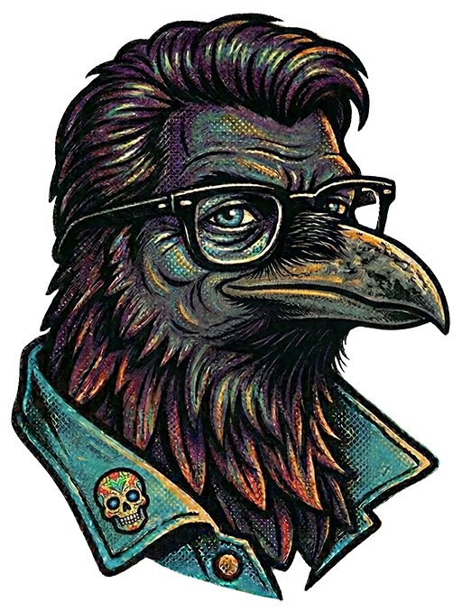

<div align="center">
  
  <p>Agent Crowner</p>
</div>

# CrowForge

**Stop Managing. Start Creating.**

Developed by indie game developers from **rembrosoft.com**, CrowForge is born from the need for a unified, local-first AI workspace. We understand the struggle of juggling disparate tools like spreadsheets, documents, Azure services, and Miro boards. That's why we're building CrowForge: a powerful, integrated platform designed to bring everything together, running entirely on your machine with robust local AI support.

**Our core philosophy:** No annoying notifications, no unsolicited emails, and absolutely no complicated, bloated features that users only utilize 20% of. We're focused on providing a clean, efficient, and inspiring environment for creators.

## 🚫 No More Bloatware

-   **Effortless Task Creation:** Create tasks in seconds, not minutes. No 50-field forms.
-   **Intuitive UI:** Everything you need is visible. No hidden menus. If it's not there, you probably don't need it.
-   **Inspiring Design:** Built to inspire your creativity, not depress you with endless tables.

## ✨ What Makes CrowForge Different?

-   **Documents & Tasks in Symbiosis:** Your Game Design Document (GDD) is not a static file. It's a living organism. Turn an idea into an actionable task with a single click.
-   **Blazing Fast:** As fast as your code. Experience an application without frustrating loading spinners.
-   **Indie-First Philosophy:** Built for solo developers and small teams. CrowForge won't impose corporate processes or overhead you don't need.

## 💡 Our Philosophy (Manifest)

"We believe the best tool is one you don't notice. It gets out of your way, letting your ideas flow from mind to engine."

## 💰 Transparent & Free

-   **For Individuals:** Forever free. All features unlocked.
-   **For the Community:** No tracking, no data selling, no BS.
-   **For the Love of Games:** Built for creators who love making games, not for those who love spreadsheets.

## 🗺️ Roadmap

-   **Server-Based Local Development & Testing:** Enhancing our local backend infrastructure for more robust development and testing workflows.
-   **User Management:** Implementing user management features for collaborative scenarios.

---

## 🛠️ Technical Stack

-   **Desktop Shell:** [Tauri v2](https://tauri.app/) (Rust)
-   **Frontend:** React 19, TypeScript, Vite 7, Tailwind CSS v4
-   **Backend (Sidecar):** Python 3.10+, FastAPI, Uvicorn
-   **Database:** SQLite
-   **AI Engines:**
    -   **Local:** llama-cpp-python (GGUF support)
    -   **Cloud (Optional):** OpenAI-compatible APIs, Google Gemini

---

## 💻 Installation & Development

### Prerequisites
-   [Node.js](https://nodejs.org/) (v18+)
-   [Python](https://www.python.org/) (3.10+)
-   [Rust](https://www.rust-lang.org/) (for Tauri builds)

### Setup
1.  **Clone the repository:**
    ```bash
    git clone https://github.com/yourusername/crowforge.git
    cd crowforge
    ```

2.  **Install Frontend Dependencies:**
    ```bash
    npm install
    ```

3.  **Install Backend Dependencies:**
    ```bash
    pip install -r requirements.txt
    ```

4.  **Run in Development:**
    -   Start the backend: `python -m backend.app`
    -   Start the frontend: `npm run tauri dev`

### Building for Production
CrowForge uses a sidecar architecture. You must freeze the Python backend before building the Tauri app:
1.  **Freeze Backend:** Use PyInstaller to create a standalone binary.
2.  **Move to Sidecar:** Place the binary in `src-tauri/bin/`.
3.  **Build:** `npm run tauri build`.

---

## 🛡️ Privacy & Security

CrowForge is built on the principle of **User Sovereignty**.
-   **No Cloud:** We don't have servers to store your data.
-   **No Telemetry:** We don't track how you use the app.
-   **Bring Your Own Model:** Use local GGUF files for 100% offline air-gapped AI.

---

## 📜 License

MIT — see [LICENSE](LICENSE) for details.

**Made by Lubomir Timko** ([sanchez.sk](https://www.sanchez.sk))
