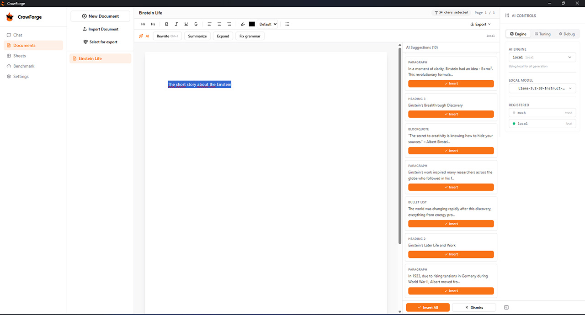
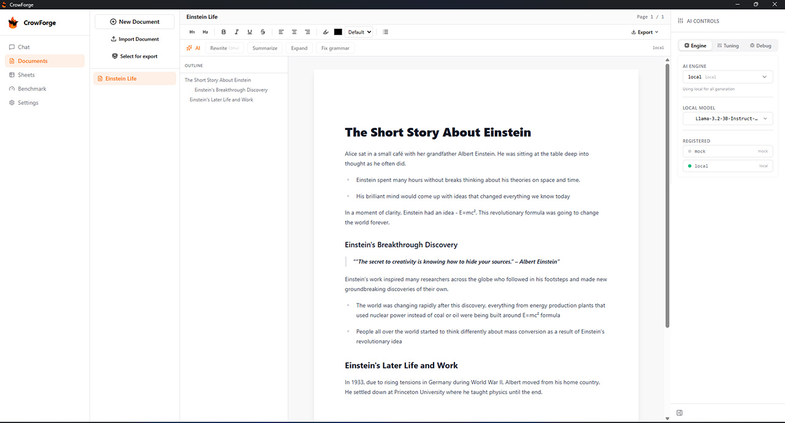
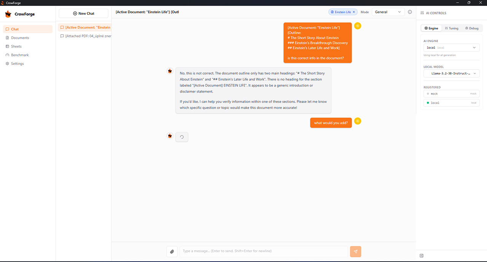
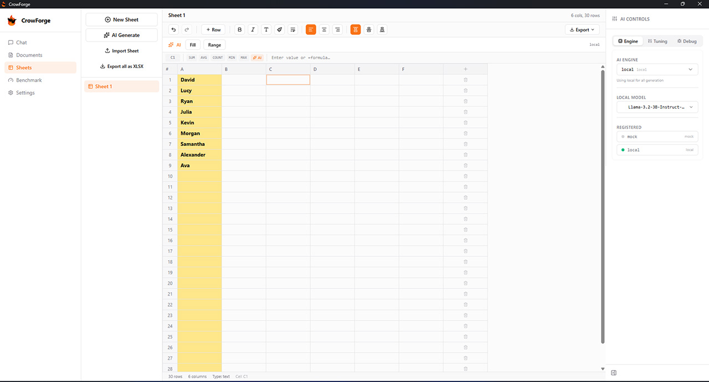
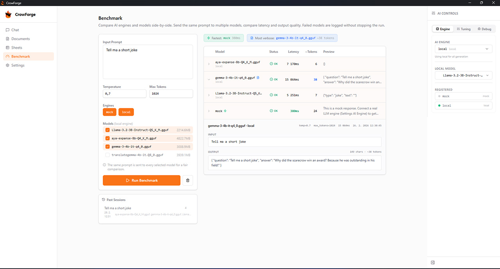
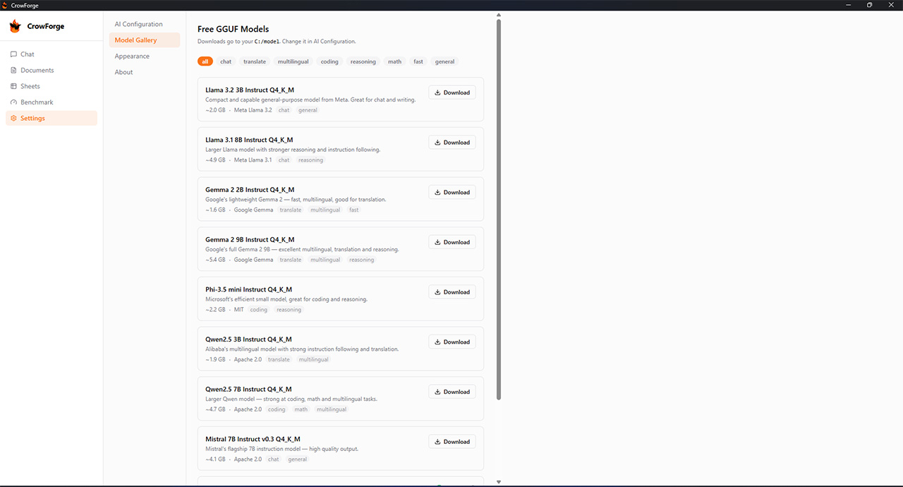

# CrowForge

A **local-first AI workspace** — Chat, Documents, Sheets, and Benchmarking — running entirely on your machine. No cloud, no telemetry, no subscriptions.

Bring your own model: connect a local GGUF file, any OpenAI-compatible API (OpenAI, Ollama, LM Studio, etc.), or download a free model directly from the built-in gallery.

Built with **Tauri v2** · **React 19 / TypeScript** · **Python FastAPI** · **SQLite**

> **🚧 Early Access** — CrowForge is actively being developed. Things may break, features are still being added, and the project is evolving fast. Feedback, issues, and contributions are very welcome!

---

## 📺 Demo

<video src="https://github.com/your-username/CrowForge/assets/teaser_v1.mp4" width="100%" controls autoplay loop muted>
  Your browser does not support the video tag.
</video>

---

## 📸 Screenshots

### AI Agent & Documents

 

### Chat & AI Sheets

 

### Model Gallery & Benchmarking

 

---

## What's new in v0.2

- **AI Agent** — ReAct-style agent that can autonomously read/write sheets and documents.
- **Image Support** — Insert images from disk directly into your documents.
- **Document Search** — Full-text search across your local knowledge base.
- **AI Row Generation** — Generate entire sets of sheet rows from a simple description.
- **Data Privacy** — One-click data deletion and backend management.

---

## Core Features

### 💬 Chat
- Multi-session history with persistent local storage.
- Context modes: General, Writing, Coding, Analysis, Brainstorm.
- Document-aware Q&A: Attach your docs as context.
- Attach files (PDF, TXT, DOCX) directly to messages.

### 📄 Documents
- Rich text editor with advanced AI writing tools (Rewrite, Summarise, Expand).
- AI Suggestions: Generate paragraphs, headings, and quotes in one click.
- Export to **PDF**, **DOCX**, or **Markdown**.

### 📊 Sheets
- Powerful local spreadsheet with unlimited rows/columns.
- **AI Fill & Generate**: Describe what you want, and the AI builds the data.
- Built-in templates for CRM, Task Lists, Budgets, and more.
- Export to **XLSX** or **CSV**.

### 📈 Benchmark
- Compare multiple models side-by-side with the same prompt.
- Real-time latency, token count, and output comparison.
- Save and reload past benchmark sessions.

---

## 🛠 Technical Information

For detailed instructions on how to set up and build the project, or to understand its internal architecture, please refer to the following documents:

- 📥 **[Installation and Setup Guide](docs/INSTALLATION.md)** — Prerequisites, environment config, and build steps.
- 🏗️ **[Architecture and Structure](docs/ARCHITECTURE.md)** — Project layout and technical stack overview.

---

## Credits

**Made by Lubomir Timko** ([sanchez.sk](https://www.sanchez.sk)), with AI assistance from **Claude** (Anthropic).

---

## License

MIT — see [LICENSE](LICENSE) for details.
