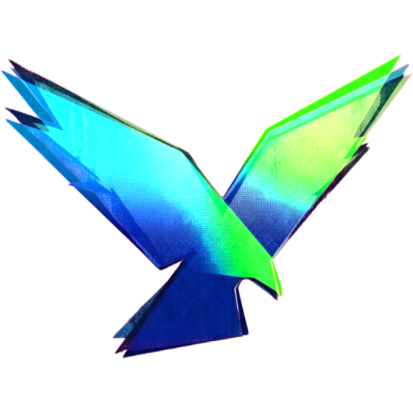

# CrowForge

A **local-first AI workspace** — Chat, Documents, Sheets, and Benchmarking — running entirely on your machine. No cloud, no telemetry, no subscriptions.

> [!IMPORTANT]
> **Alpha Version:** CrowForge is currently in early alpha. We are actively testing features and fixing bugs. Expect frequent updates and potential breaking changes.

**CrowForge v0.3** brings even more power to your local machine with a comprehensive "Help!" system, AI News Digest, and visual workflow canvas.

---

## 🚀 Key Features

### 🧠 Intelligent Chat
- **Multi-session Persistence:** Never lose a conversation.
- **Context Personas:** Specialized modes for Coding, Writing, Analysis, and General assistance.
- **Document Awareness:** Attach open documents or PDFs directly to your chat for hyper-specific context.

### 📝 Smart Documents
- **Rich Text Editor:** Powered by Tiptap with full Markdown support.
- **AI Context Toolbar:** Select text to Rewrite, Summarize, Expand, or Fix Grammar instantly.
- **Export Everywhere:** Save your work as PDF, DOCX, or Markdown.

### 📊 AI Spreadsheets
- **Autonomous Data Fill:** Use AI to generate or process data across thousands of rows.
- **Formula Support:** Standard spreadsheet logic (=SUM, =AVG) combined with AI schema generation.
- **Data Privacy:** Your datasets never leave your local SQLite database.

### 🤖 ReAct Agent
- An autonomous assistant that can **read and edit** your workspace files.
- Capable of multi-step reasoning to solve complex tasks across Documents and Sheets.

### 📰 AI News Digest
- Subscribe to RSS/Atom feeds and let the AI curate a personalized daily summary for you.
- Stay informed without the noise, all processed locally.

### 🎨 Infinite Canvas
- A visual node-based workspace for brainstorming and mapping out data flows.

---

## 🛠️ Technical Stack

- **Desktop Shell:** [Tauri v2](https://tauri.app/) (Rust)
- **Frontend:** React 19, TypeScript, Vite 7, Tailwind CSS v4
- **Backend (Sidecar):** Python 3.10+, FastAPI, Uvicorn
- **Database:** SQLite
- **AI Engines:**
  - **Local:** llama-cpp-python (GGUF support)
  - **Cloud (Optional):** OpenAI-compatible APIs, Google Gemini

---

## 💻 Installation & Development

### Prerequisites
- [Node.js](https://nodejs.org/) (v18+)
- [Python](https://www.python.org/) (3.10+)
- [Rust](https://www.rust-lang.org/) (for Tauri builds)

### Setup
1. **Clone the repository:**
   ```bash
   git clone https://github.com/yourusername/crowforge.git
   cd crowforge
   ```

2. **Install Frontend Dependencies:**
   ```bash
   npm install
   ```

3. **Install Backend Dependencies:**
   ```bash
   pip install -r requirements.txt
   ```

4. **Run in Development:**
   - Start the backend: `python -m backend.app`
   - Start the frontend: `npm run tauri dev`

### Building for Production
CrowForge uses a sidecar architecture. You must freeze the Python backend before building the Tauri app:
1. **Freeze Backend:** Use PyInstaller to create a standalone binary.
2. **Move to Sidecar:** Place the binary in `src-tauri/bin/`.
3. **Build:** `npm run tauri build`.

---

## 🛡️ Privacy & Security

CrowForge is built on the principle of **User Sovereignty**.
- **No Cloud:** We don't have servers to store your data.
- **No Telemetry:** We don't track how you use the app.
- **Bring Your Own Model:** Use local GGUF files for 100% offline air-gapped AI.

---

## 📜 License

MIT — see [LICENSE](LICENSE) for details.

**Made by Lubomir Timko** ([sanchez.sk](https://www.sanchez.sk))
